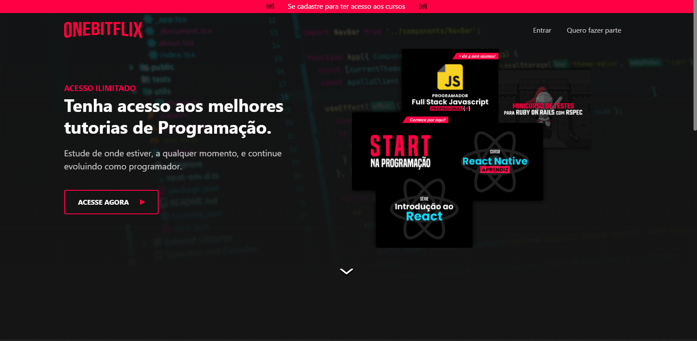
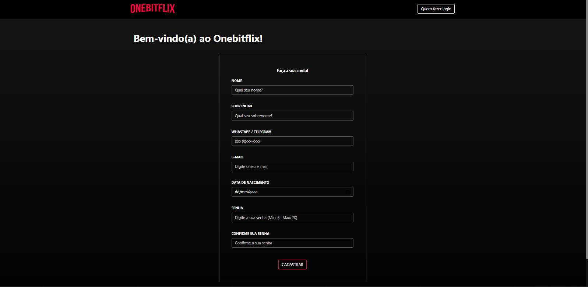
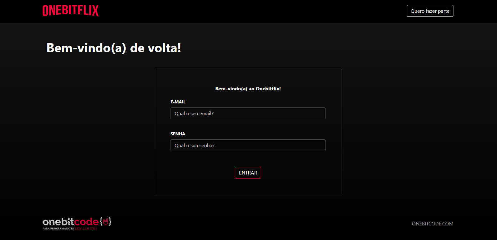
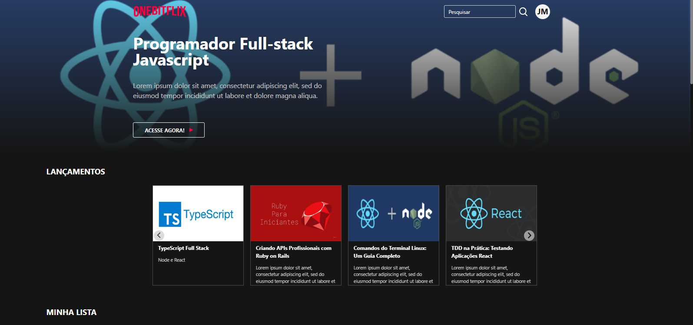
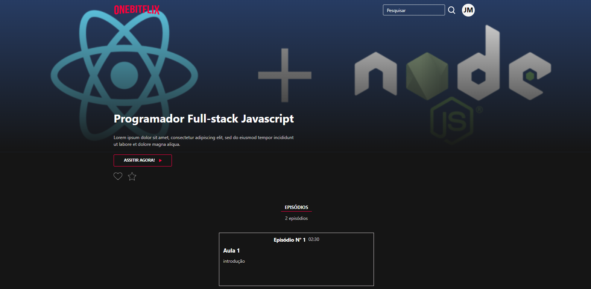
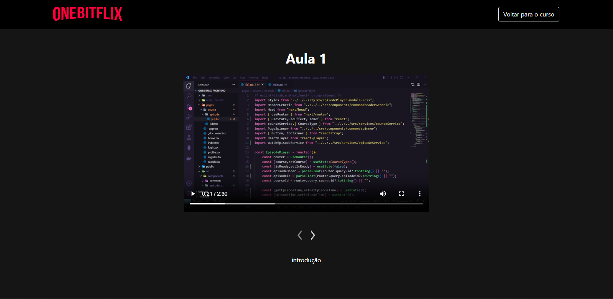
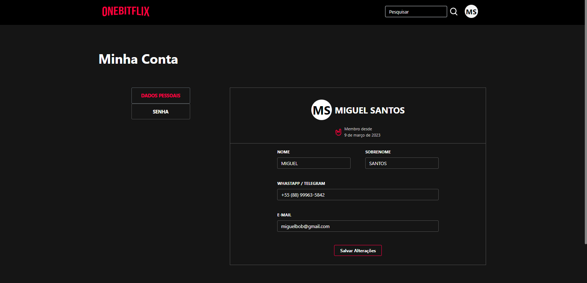
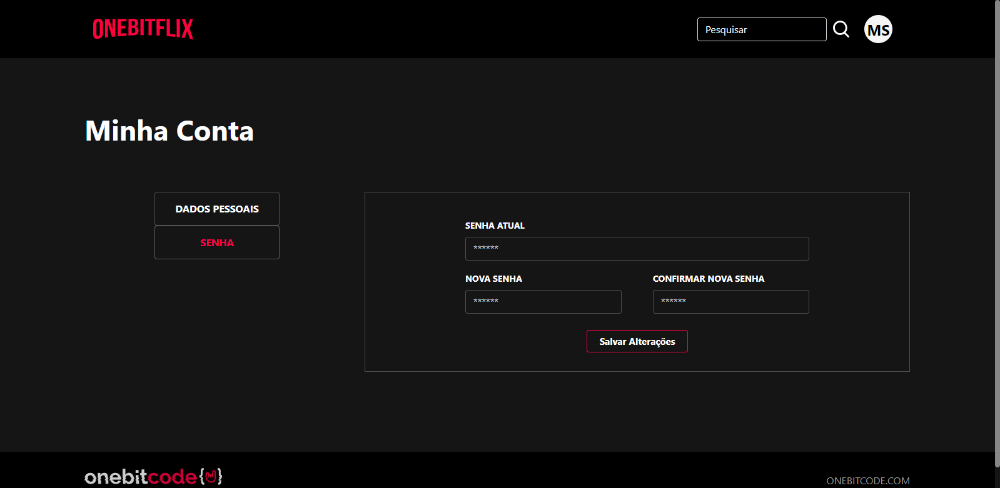

# onebitflix-frontend
- Projeto do onebitflix consiste na criação de uma aplicação web, no qual os usuários cadastrados poderam assistir os cursos com vários episódios em diversas categorias. Podendo também favoritar um curso e dá like.

## Tecnologias utilizadas no projeto:
- React, Bootstrap, Sass
- Nodejs, Sequelize ORM [Backend](https://github.com/lucasops96/onebitflix)

## Page de Apresentação

  

## Page Register

  

## Page Login

  

## Page Home

  

## Page Course

  

## Page Episode

  

## Page Profile

  

## Page Profile-password

  

